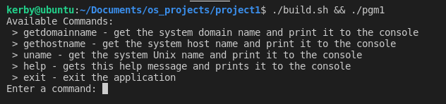
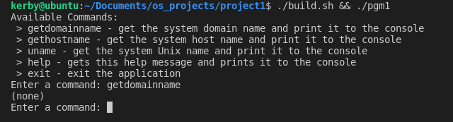
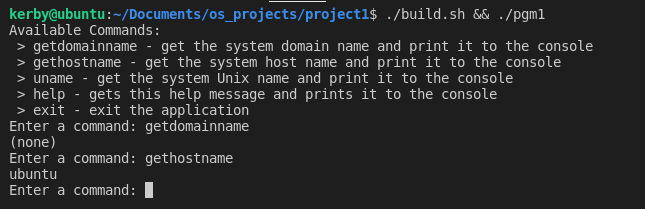
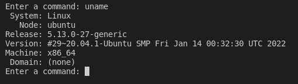
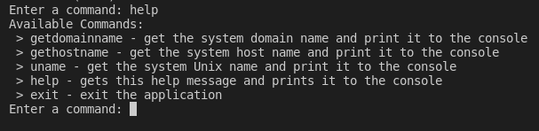
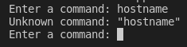
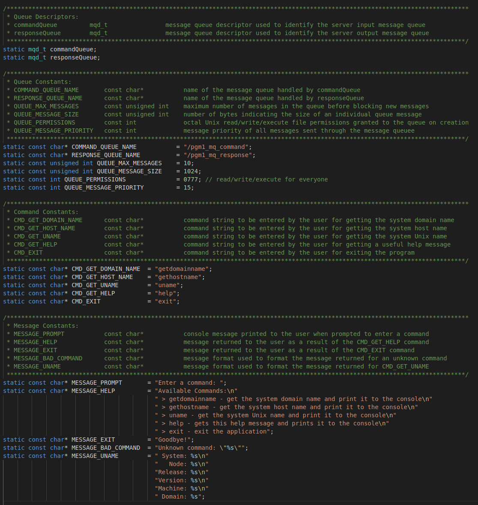

# UNIX-like programming for C++ Developers - Message Queues

This is a multi-process client/server program for UNIX-like operating systems that utilize [**message queues**](https://man7.org/linux/man-pages/man7/mq_overview.7.html "Linux manual page for message queues") to transfer requests and results. The client process makes requests to the server, waits for a result, and then prints the result to the console. The server process listens for incoming requests, executes the proper function based on the given command, and returns the result to the client. 

***This project has only been tested on Ubuntu 20.04.03 LTS***

### **Why?**
This project was created as a clear, concise, and well documented introduction to programming in a UNIX-like environment for students and C++ developers unfamiliar with working with C-style UNIX APIs, as well as a reference guide for how to use common UNIX-like system calls. Additionally, it serves as a guide for compiling executables using a command line interface, which may be unfamiliar to developers who have only used IDEs.

It includes the following methods:

* [**fork**](https://man7.org/linux/man-pages/man2/fork.2.html "Linux manual page for fork()")
* [**mq_open**](https://man7.org/linux/man-pages/man3/mq_open.3.html "Linux manual page for mq_open()")
* [**mq_unlink**](https://man7.org/linux/man-pages/man2/mq_unlink.2.html "Linux manual page for mq_unlink()")
* [**mq_send**](https://man7.org/linux/man-pages/man3/mq_send.3.html "Linux manual page for mq_send()")
* [**mq_receive**](https://man7.org/linux/man-pages/man2/mq_timedreceive.2.html "Linux manual page for mq_receive()")
* [**getdomainname**](https://man7.org/linux/man-pages/man2/getdomainname.2.html "Linux manual page for getdomainname()")
* [**gethostname**](https://man7.org/linux/man-pages/man2/gethostname.2.html "Linux manual page for gethostname()")
* [**uname**](https://man7.org/linux/man-pages/man2/uname.2.html "Linux manual page for uname()")
* [**signal**](https://man7.org/linux/man-pages/man7/signal.7.html "Linux manual page for signal()")
* [**perror**](https://man7.org/linux/man-pages/man3/perror.3.html "Linux manual page for perror()")
* [**strerror**](https://man7.org/linux/man-pages/man3/strerror.3.html "Linux manual page for strerror()")
* [**kill**](https://man7.org/linux/man-pages/man1/kill.1.html "Linux manual page for kill()")
* [**waitpid**](https://man7.org/linux/man-pages/man3/waitpid.3p.html "Linux manual page for waitpid()")

As well as various C-style string parsing, copying, and manipulating:
* [**strcmp**](https://en.cppreference.com/w/c/string/byte/strcmp "cppreference to strcmp()")
* [**strncpy**](https://en.cppreference.com/w/c/string/byte/strncpy "cppreference to strncpy()")
* [**snprintf**](https://en.cppreference.com/w/cpp/io/c/fprintf "cppreference to snprintf()")

And some C-style program control:
* [**exit**](https://en.cppreference.com/w/c/program/exit "cppreference to exit()")
* [**EXIT_SUCCESS, EXIT_FAILURE**](https://en.cppreference.com/w/c/program/EXIT_status "cppreference to EXIT_SUCCESS, EXIT_FAILURE")
  
***This project, while written for C++, could easily be translated to C with minor changes***

# Problem Statement

The assigned task was to create a multi-process client/server program using [**fork**](https://man7.org/linux/man-pages/man2/fork.2.html "Linux manual page for fork()") that utilizes [**message queues**](https://man7.org/linux/man-pages/man7/mq_overview.7.html "Linux manual page for message queues") to transfer requests and results. The client process makes requests to the server, waits for a result, and then prints the result to the console. The server process listens for incoming requests, executes the proper function based on the given command, and returns the result to the client. 

Three functions are asked to be implemented: 
* [**getdomainname**](https://man7.org/linux/man-pages/man2/getdomainname.2.html "Linux manual page for getdomainname()") - get the system domain name and print it to the console
* [**gethostname**](https://man7.org/linux/man-pages/man2/gethostname.2.html "Linux manual page for gethostname()") - get the system hostname and print it to the console
* [**uname**](https://man7.org/linux/man-pages/man2/uname.2.html "Linux manual page for uname()") - get the system Unix name and print it to the console

These three functions should invoke the corresponding UNIX functions of the same name. For our operating system, we were asked to use Ubuntu 20.04 LTS.

# Approach

First, a virtual machine was required to build, test, and execute the program. I used VMWare as my virtual machine environment, as it was already installed on my machine. I downloaded the latest ISO of Ubuntu Desktop, version 20.04.03 LTS, and created an environment suitable for development. All build tools were installed using the following command:

### Command to install required build tools:

    sudo apt install build-essential

The way in which commands are supplied by the client was not specified, so I decided to create an interactive program which prompts the user for commands to input. I find this approach useful as it allowed me to include a **help** command, making the user experience much more friendly and the program easier to use. While this program can be written entirely in C, I decided to use C++ as I find getting user input from the console easier to do and easier to maintain in C++. Additionally, C++ allows us modern advances over C, such as std::string.

I decided on using two message queues; One for commands to the server, and one for responses to the client. This avoids a possible race condition in which the server attempts to interpret the results of a command as a new command, or the client interpreting a command as its result. The send and receive commands are both blocking, so it’s entirely possible to utilize a single message queue, however I felt this was less maintainable to more prone to bugs. Since the program is interactive, the client and server will both need event loops. An additional  **exit** command was added to allow the user a way to exit these event loops and terminate the program. 

### Additional Commands:

* **help** - gets a help message for program usage and print it to the console
* **exit** - exit the application

I decided to implement signal handlers on interrupt and exit to ensure that message queue resources are properly disposed of. Because the program is interactive, the user can perform a signal interrupt with **CTRL+C** from the terminal at any time, which would bypass the program flow of normal cleanup and potentially leave artifacts outside of the lifetime of the program. Additionally, a wait command is added to the server upon termination to ensure that our created client process does not create a zombie process.

# Solution

The program begins by opening two message queues, unlinking them so they are deleted when both processes exit, and then invoking **fork()** to create the client and server processes. From here, the roles of the client and server are essentially reversed. Throughout the program, extensive error checking is done for each system call. A useful error message is printed to the console should any system call fail, and the program is terminated **EXIT_FAILURE**. Should no error messages occur, both client and server processes terminate **EXIT_SUCCESS**.

## Client
The client begins by printing a help message, which shows the available commands, and prompting the user to input a command. Then, an event loop is started which waits for a command to be input. Once a command has been entered by the user, it is sent to the server on the command message queue. The client then waits for a response on the response message queue. Upon receiving a response from the server, it is printed to the console and the user is prompted to enter another command. This loop repeats until the user enters the **exit** command. After sending the exit command to the server, the event loop exits, and all message queue resources are cleaned up. No command validation is done on the client side. This allows commands to easily be added to the server portion only and avoid having to change code in two locations when adding, removing, or modifying commands. Examples of each command can be seen in Figures 2 through 6.

## Server

The server begins by starting an event loop and waiting for an incoming command on the command message queue. Once a command has been received from the client, it is parsed to see what command it matches. If it does not match any known command, an unknown command response in returned to the client, formatted using the unrecognized command. If any of the system calls fail, a string error message is returned to the client instead, stating why the command failed. All messages to the client are returned on the response message queue.

If **getdomainname** is provided, the UNIX function [**getdomainname**](https://man7.org/linux/man-pages/man2/getdomainname.2.html "Linux manual page for getdomainname()") is called and sent to the client. 

If **gethostname** is provided, the UNIX function [**gethostname**](https://man7.org/linux/man-pages/man2/gethostname.2.html "Linux manual page for gethostname()") is called and sent to the client. 

If **uname** is provided, the UNIX function [**uname**](https://man7.org/linux/man-pages/man2/uname.2.html "Linux manual page for uname()") is called and a formatted string is returned to the client which contains all 6 components. 

If the **help** command is provided, a help message is returned to the client. 

If the **exit** command is provided, an exit message is returned to the client and the server event loop exits. The server then waits for the client process to exit before cleaning up all message queue resources.

# Building & Executing

To build the program, ensure that the “build-essential” toolset is installed. This installs the required g++ compiler to compile and link our executable. Then, run the following command from the program working directory:

    g++ -o pgm1 main.cpp -lrt

Where:
* **g++** is the name of our compiler
* **-o** is a compiler flag indicating that we are creating an object
* **pgm1** is the name of our object being created (our executable)
* **main.cpp** is the source code of our object
* **-lrt** is a linker flag to indicate that we need to link against the “real time” system library

Running this command will create an executable named **pgm1** in the current working directory. The program can then be executed with the following command:

    ./pgm1

No command line arguments are expected and will simply be ignored if provided. Program usage and results will be printed to the console. This can be seen in Figure 1.

# Developer Notes

Many static global constant variables are available and documented in **main.cpp**, which allow easy configuration of queue behavior, such as the queue names, message size, and queue file permissions. Global variables are typically bad programming practice, but in a program this small, I do not feel that this damages the maintainability or readability of the program. Additionally, the message queue descriptors are required to be global variables to be cleaned up by the signal handler, since signal handlers cannot receive any additional arguments (to the best of my knowledge). This also allows easy configuration of existing commands, addition of new commands, and modification of response messages and formats. These options can be seen in more detail in Figure 7.

# Figures

Figure 1 - Client Start

Figure 2 - Example of **getdomainname** command:

Figure 3 - Example of **gethostname** command:

Figure 4 - Example of **uname** command:

Figure 5 - Example of **help** command:

Figure 6 - Example of an unknown command sent to the server:

Figure 7 - All global developer configurable constants. These constants must be modified prior to compilation of the program:

